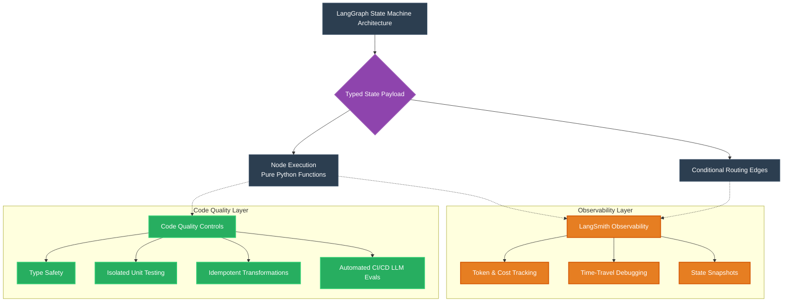

# LangGraph: Observability & Code Quality Infographic

### 1. Robust State Management
By enforcing strict data structures (via `TypedDict` or `Pydantic`), LangGraph eliminates ambiguous typings between steps. Data quality controls naturally sit at the state validation boundary.

### 2. Deep Observability (LangSmith)
Observability is a first-class citizen. LangSmith tracks execution paths, meaning you can look at the output graph visually, see latency down to the millisecond per node, and "rewind" to the precise state payload that caused a crash to test it locally.

### 3. Modularity & Testing
Because every Node in LangGraph is just a standard Python function that takes a State and returns a State update, code quality improves automatically: nodes become easily unit-testable in pure isolation without needing the entire graph to run.
