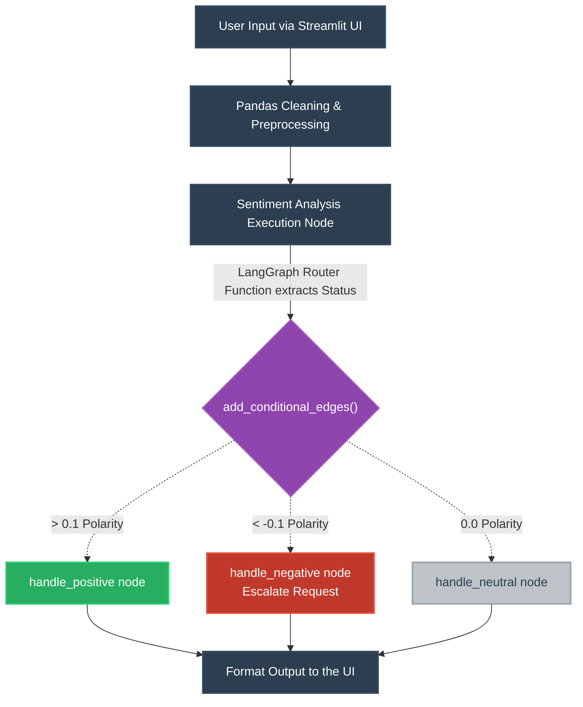

# LangGraph: Conditional Branching & Sentiment Analysis Architecture

### Overview of Dynamics

The **LangGraph Router** logic physically isolates your decision-making boundaries from your strict application boundaries. Because the edge layer determines routing strictly across pre-registered node labels (*e.g., `POSITIVE`, `NEGATIVE`*), your execution pipeline can dynamically fork without bloating a single file or standard Python namespace.
