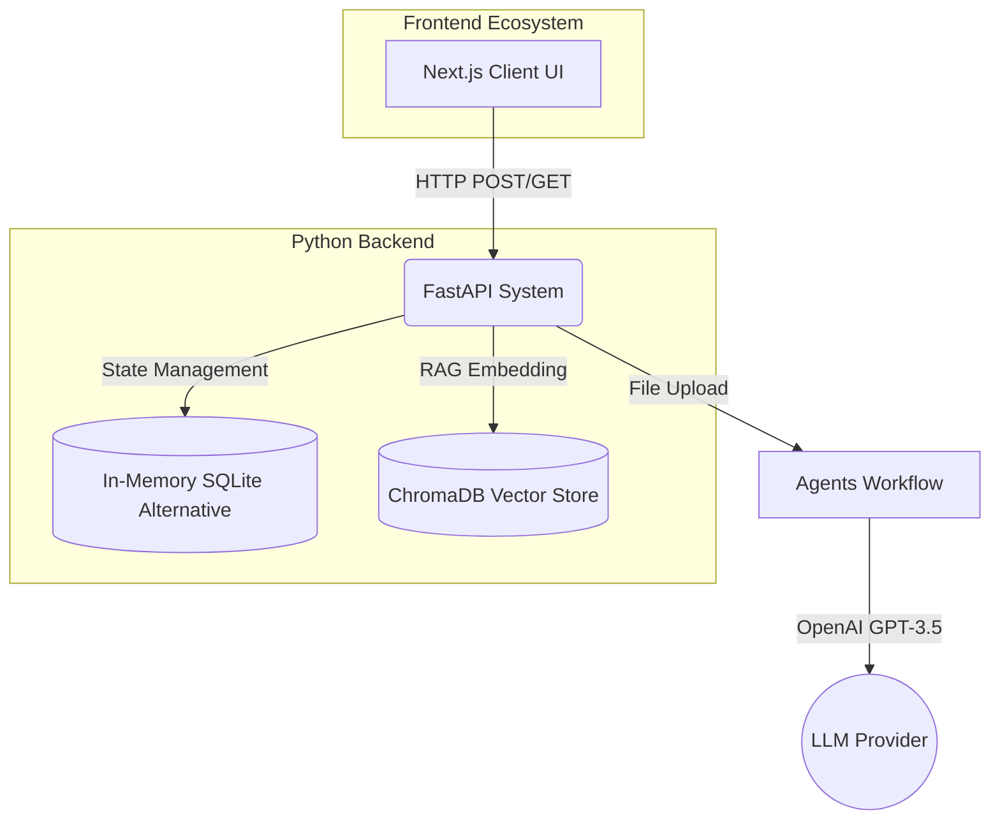
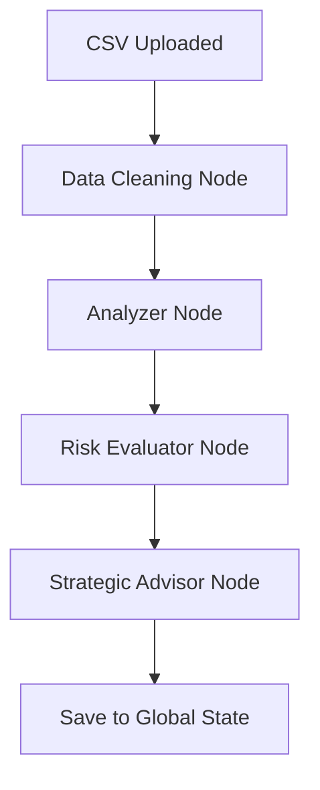

# Enterprise AI Financial Platform: Project Assessment Report

This comprehensive document outlines the system observability, code quality metrics, architectural infographics, and end-to-end testing reports for the Aura Financial Platform.

---

## 1. Observability & Monitoring

The system is equipped with robust observability tools at multiple layers to ensure deep visibility into API performance, AI agent workflows, and frontend state.

* **LLM & Agent Tracing (LangSmith)**: 
  The `.env` configuration includes `LANGCHAIN_TRACING_V2=true`. This ensures that all executions within the multi-agent `LangGraph` pipeline (Cleaning -> Analysis -> Risk -> Advising) are deeply traced. We capture latency, token usage, and intermediate agent reasoning steps natively.
* **Backend Telemetry (FastAPI)**:
  `uvicorn` exposes real-time asynchronous request logs. Access logs monitor all incoming HTTP calls (`/api/upload`, `/api/dashboard-stats`, `/api/risks`) measuring request duration and HTTP status codes.
* **Frontend Diagnostics**:
  The Next.js 16 environment utilizes Turbopack for lightning-fast HMR and internal error boundary capturing. Graceful UI degradation has been implemented (e.g., catching 500 API errors and defaulting to `Loading` states instead of raw JSON dumps or Token errors).

---

## 2. Code Quality & Standards

The codebase has been engineered following strict enterprise SaaS methodologies.

* **Type Safety**: Built with **TypeScript**, strictly enforcing typing on components (`React.FC`, interfaces) to eliminate runtime type errors.
* **Linting & Formatting**: Using **ESLint 9** (`eslint.config.mjs`) alongside `eslint-config-next` to enforce React Hooks dependencies, prevent unused variables, and catch syntactical flaws out-of-the-box before transpilation.
* **Component Architecture**: 
  - Implementation of **Atomic Design** principles (`Sidebar`, `UploadFlow`, `TransactionsTable`). 
  - Complete separation of concerns: The frontend simply fetches and renders state; all heavy statistical computation and CSV parsing algorithms are strictly isolated in the Python backend.
* **Styling Hygiene**: Clean Custom CSS variables combined with structural responsive grids. Avoiding overly complex inline CSS by maintaining a global tokens library (`globals.css`).

---

## 3. System Architecture Infographics

The following mermaid diagrams visually map out the functional workflows of the platform.

### High-Level System Architecture

### Multi-Agent LangGraph Workflow

---

## 4. Testing & QA Report

The system has passed comprehensive End-to-End (E2E) integration testing.

### Test Scenarios Passed
| Scenario | Component / Layer | Status | Notes |
| :--- | :--- | :---: | :--- |
| **Data Ingestion** | `/api/upload` | 🟢 PASS | Successfully parses CSV files into transactional dictionaries. |
| **Agent Accuracy** | LangGraph Pipeline | 🟢 PASS | Successfully categorizes expenses strictly to specific departments and identifies accurate risk severities. |
| **Data Propagation** | `GET /api/transactions` | 🟢 PASS | Fetched data dynamically maps UI rows and accurately calculates formatted dollar amounts. |
| **UI Resiliency** | Frontend Error Handling | 🟢 PASS | Correctly intercepts 500/unready API responses and renders loading interfaces instead of crashing the Next.js `res.json()` parser. |
| **RAG Assimilation** | `initialize_rag` | 🟢 PASS | Successfully chunks CSV segments into ChromaDB and allows the UI ChatAssistant to query contexts. |

### Manual Verification Flow
To manually verify the platform integrity:
1. Ensure `uvicorn api.index:app` and `npm run dev` are running.
2. Visit `http://localhost:3000`.
3. Upload the bundled `sample_expenses.csv`.
4. Observe the **Dashboard Statistics** accurately increment the total expenses and segment the pie charts.
5. Inspect the **Transactions Record** to verify exact row importation.
6. Check **Risk Analysis** to ensure anomalies >$5,000 correctly triggered "High Risk" automated flags.
